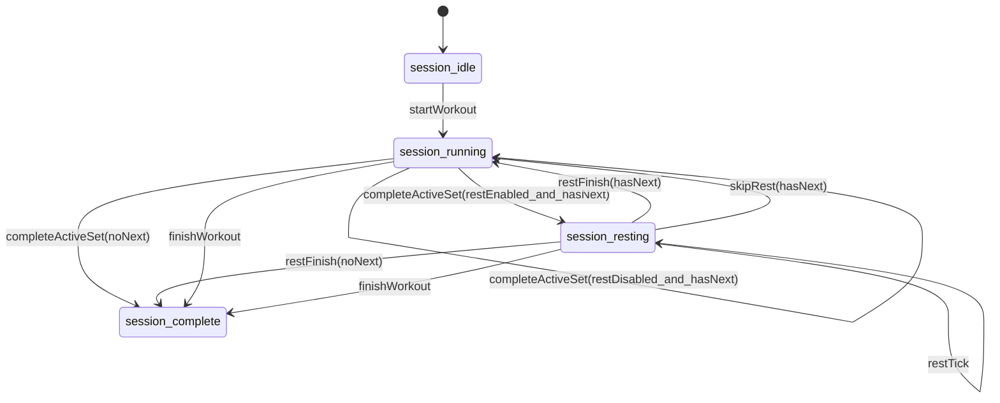

# Next Lift Runtime State Machine Specification

## 1. Purpose
Define deterministic runtime behavior for set progression, global rest handling, mutation permissions, and workout completion.

This document is governed by final V1 decision overrides in `docs/specs/decision-lock-v1.md`.

## 2. State Domains

### 2.1 Set State
- `set_ready`
- `set_active`
- `set_complete`

### 2.2 Session Phase
- `session_idle`
- `session_running`
- `session_resting`
- `session_complete`

### 2.3 Global Rest Timer State
- `rest_disabled`
- `rest_armed`
- `rest_running`
- `rest_finished`

## 3. Invariants
- Exactly one set may be `set_active` while `session_running`.
- No set may transition out of `set_complete`.
- `session_complete` is terminal for runtime progression.
- Rest timer does not alter completed-state immutability.

## 4. Event Catalog
- `startWorkout()`
- `completeActiveSet()`
- `restTick(msDelta)`
- `restFinish()`
- `skipRest()`
- `activateNextSet()`
- `editCompletedSet(setId, patch)`
- `appendShape(shapeSpec)`
- `reorderShape(dragPayload)`
- `augmentShape(dragPayload)`
- `appendSetToShape(shapeId, setSpec)`
- `finishWorkout()`

## 5. Transition Rules

### 5.1 Start
`session_idle --startWorkout--> session_running`
- Guard: at least one executable set exists.
- Action: first eligible `set_ready` becomes `set_active`.

### 5.2 Complete Active Set
`session_running --completeActiveSet--> session_resting | session_running | session_complete`
- Action A: mark active set `set_complete`.
- Branch:
  - If rest enabled and next set exists: enter `session_resting`, start global rest.
  - If rest disabled and next set exists: activate next set immediately, remain `session_running`.
  - If no next set: transition to final CTA state (`Workout Complete`) without starting rest.

### 5.3 Rest Progression
`session_resting --restTick--> session_resting`
- Action: decrement remaining rest duration.

`session_resting --restFinish--> session_running | session_complete`
- If next set exists: activate next set and return to running.
- If no next set: session waits for explicit workout finish action.

`session_resting --skipRest--> session_running | session_complete`
- Same branch behavior as `restFinish`.

### 5.4 Finish Workout
`session_running|session_resting --finishWorkout--> session_complete`
- Guard: no active set remains, or user confirms end-of-session action when progression is exhausted.
- Actions:
  - Stop workout timer.
  - Disable append/augment/reorder actions.
  - Commit derived stats snapshot.

## 6. Rest Timer Integration
- Rest timer is global and session-scoped, not attached to individual set state.
- `completeActiveSet()` is the only event that arms rest.
- Rest visibility is conditional: shown only while `session_resting`.
- Rest completion can trigger cue channels (sound/light/haptic) if enabled.

## 7. Mutation Guard Rules During Active Session

### 7.1 Allowed
- `appendShape` (always appends bottom while session not complete).
- `appendSetToShape` on shape not fully complete.
- `editCompletedSet` (value edit only, no state rollback).

### 7.2 Conditionally Allowed
- `reorderShape` and `augmentShape` only when destination target and source-impact scope contain only `set_ready` sets.

### 7.3 Rejected
- Any operation that changes order/structure involving `set_active` or `set_complete`.
- Any attempt to transition `set_complete -> set_ready|set_active`.

## 8. Deterministic Set Selection
`activateNextSet()` uses canonical order:
1. Top-level shape order.
2. Nested execution order as resolved by workout grammar.
3. First `set_ready` found by preorder traversal.

If no `set_ready` exists, emit `progressionExhausted` internal signal.

## 9. Completed Set Editing Semantics
- Allowed fields: tracked metric values and optional notes.
- Disallowed changes: exercise identity, structural membership, execution timestamp ordering.
- Edit side effect: marks derived stats as dirty and triggers recalculation.

## 10. Error and Recovery
- On invalid event/guard failure: no-op state mutation plus user-visible feedback.
- On app interruption: restore session state from persisted event log.
- On resume, rest timer state recalculates from persisted timestamp and configured behavior.

## 11. Reference State Diagram

